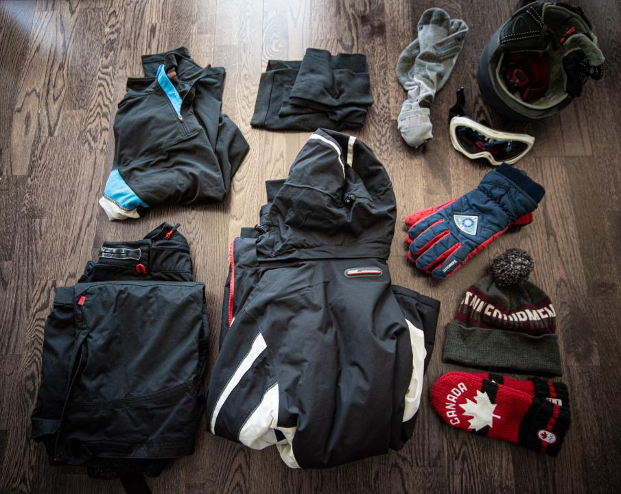

# expedition_one

Welcome to my Arctiq expedition!

## Prerequisites
```YAML
tasks:
  - name: Gather epic equip. Need toque and mittens, eh?
    equip:
      name: "{{ item }}"
      state: present
    loop:
      - toque
      - mittens
      - gloves
      - goggles
      - helmet
      - headlamp
      - socks
      - thermalshirt
      - thermalunderwear
      - snowpants
      - snowjacket
```



## Logbook

Some log entries from my journey can be found in *LOGBOOK.md*.
